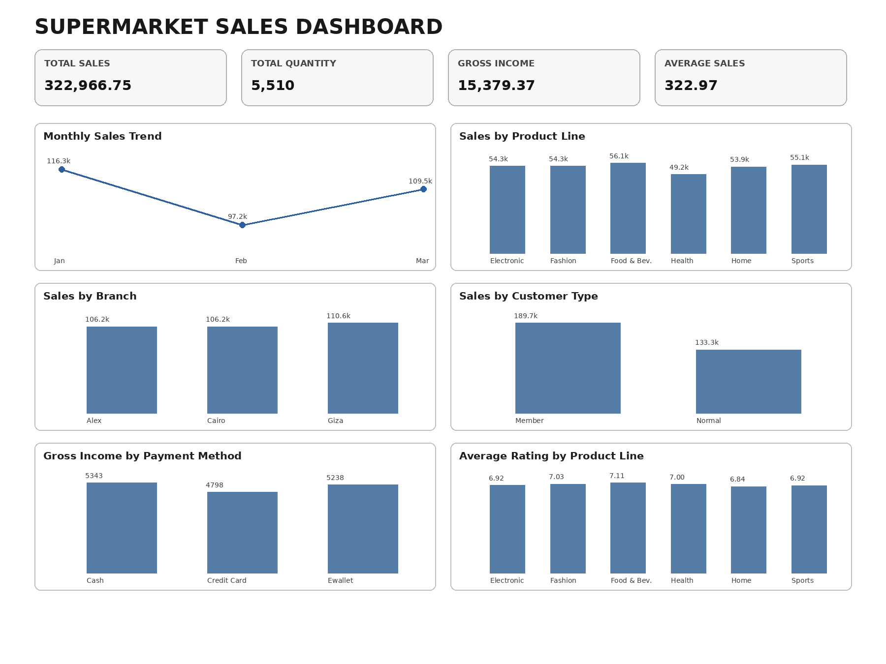

# Supermarket Sales Analysis & Excel Dashboard

## 📊 Project Overview

This project analyzes supermarket sales data using Microsoft Excel to identify sales trends, product-line performance, branch performance, customer behavior, payment-method patterns, and overall business performance.

The project includes data analysis using Excel formulas and PivotTables, followed by the development of an interactive-style Excel dashboard containing key performance indicators and visualizations.

## 🎯 Business Objectives

- Analyze overall sales and transaction performance
- Identify the best-performing product lines
- Compare sales performance across branches
- Analyze customer-type purchasing behavior
- Examine monthly sales trends
- Analyze payment-method performance
- Evaluate customer ratings across product lines
- Develop a clear management-friendly dashboard

## 🛠️ Tools & Skills

- Microsoft Excel
- Data Cleaning & Validation
- PivotTables
- KPI Analysis
- Exploratory Data Analysis (EDA)
- Data Aggregation
- Data Visualization
- Dashboard Development
- Business Insights

## 📌 Key Performance Indicators

| KPI | Value |
|---|---:|
| Total Sales | 322,966.75 |
| Total Quantity | 5,510 |
| Total Gross Income | 15,379.37 |
| Average Sales per Transaction | 322.97 |

## 📈 Analysis Performed

### Sales Analysis
- Sales by Product Line
- Sales by Branch
- Sales by Customer Type
- Monthly Sales Trend

### Customer Analysis
- Member vs Normal Customer Sales
- Quantity purchased by Customer Type
- Average Customer Rating
- Gender-based analysis

### Product Analysis
- Product Line Sales
- Product Line Quantity
- Product Line Gross Income
- Product Line Average Rating

### Payment Analysis
- Payment method distribution
- Gross Income by Payment Method

## 🔎 Key Insights

- Total Sales reached 322,966.75 across 5,510 transactions.
- Food & Beverages generated the highest product-line Sales at 56,144.84.
- Food & Beverages also recorded the highest Gross Income at 2,673.56.
- Food & Beverages achieved the highest Average Rating at 7.11.
- Electronic Accessories recorded the highest Quantity Sold at 971 items.
- Giza recorded the highest branch Sales at 110,568.71.
- January was the strongest month with Sales of 116,291.87.
- February was the weakest month with Sales of 97,219.37.
- March showed a recovery in Sales, reaching 109,455.51.
- Members generated higher Sales of 189,694.76 compared with Normal customers at 133,271.99.
- Members also purchased more items, with 3,181 units compared with 2,329 units for Normal customers.
- The analysis shows a clear relationship between the February decline in transaction quantity and the corresponding decline in Sales and Gross Income.

## 📊 Dashboard

The Excel dashboard provides a consolidated view of:

- Total Sales
- Total Quantity
- Gross Income
- Average Sales
- Monthly Sales Trend
- Sales by Product Line
- Sales by Branch
- Sales by Customer Type
- Gross Income by Payment Method
- Average Rating by Product Line

## 📁 Project File

The main project workbook is:

`Supermarket_Sales_Analysis.xlsx`

## 💡 Conclusion

The analysis demonstrates how Microsoft Excel can be used to transform raw transactional data into meaningful business insights. The dashboard provides a concise overview of sales performance and helps identify high-performing products, branches, customer segments, and periods of stronger or weaker performance.

## 👤 Author

**Gopi Chandu**

Aspiring Data Analyst | Excel | Data Analysis | Data Visualization
